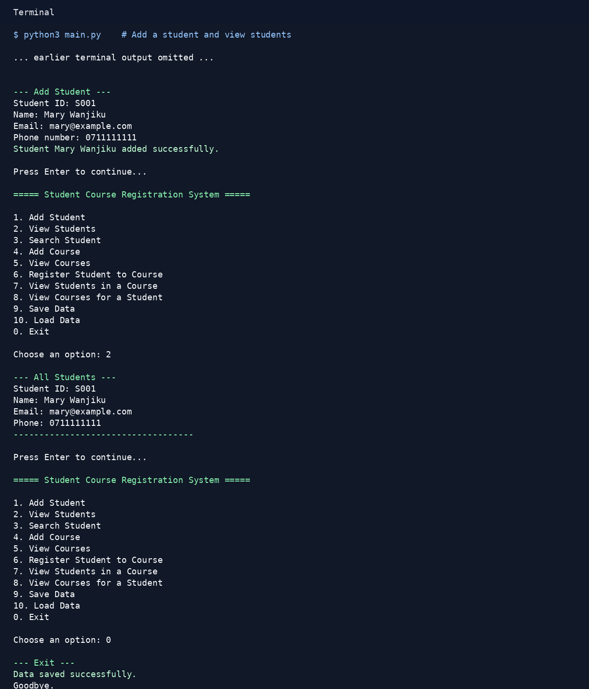
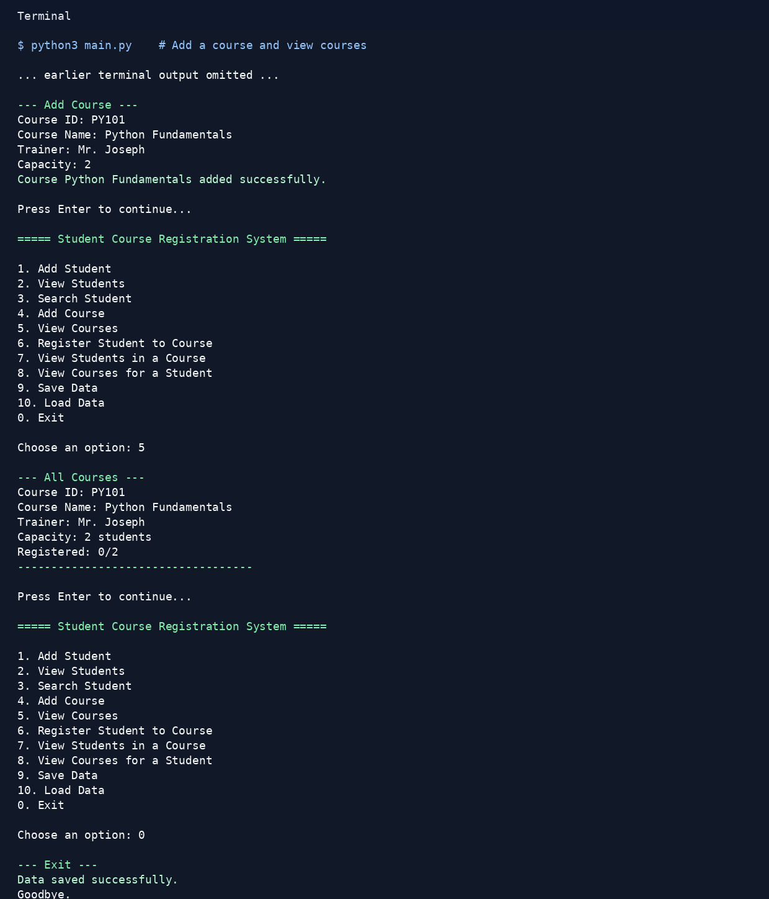
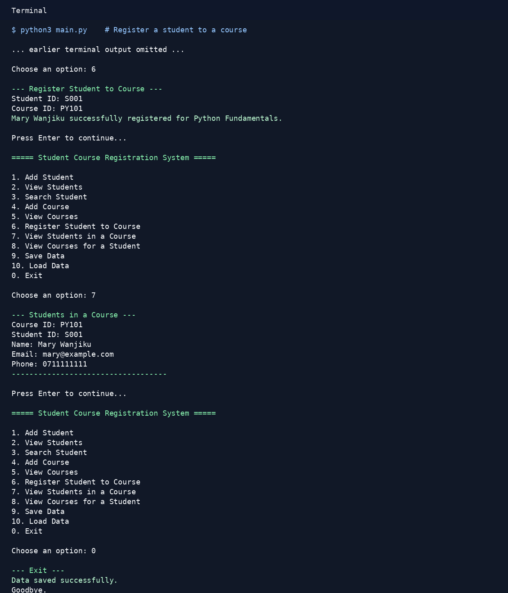
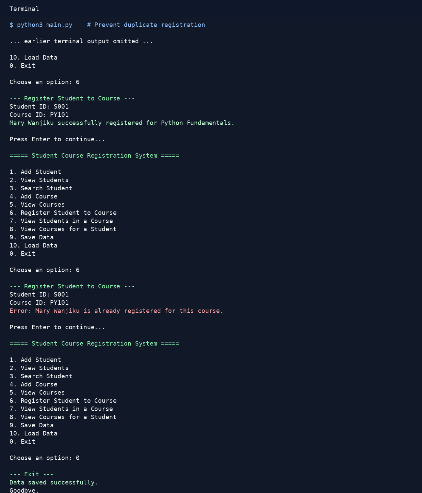

# Student Course Registration System

A terminal-based Python application for a small training school. The system helps an admin manage students, courses, and student registrations from a command-line menu.

The project starts with empty JSON data files. Students, courses, and registrations are entered through the application and saved to files, so the app does not hard-code student or course data.

## What the Project Does

The application allows an admin to:

- Add students
- View all students
- Search for students by ID or name
- Add courses
- View all courses
- Register a student for a course
- Prevent duplicate student IDs and course IDs
- Prevent duplicate registrations
- Prevent registering into a full course
- View students registered in a course
- View courses registered by a student
- Save and load data from JSON files

## How to Run the Project

Open a terminal in this project folder, then run:

```bash
python3 main.py
```

Use the menu numbers to choose an action. Data is saved in the `data/` folder.

To run the tests:

```bash
python3 -m unittest
```

## Menu Options

```text
1. Add Student
2. View Students
3. Search Student
4. Add Course
5. View Courses
6. Register Student to Course
7. View Students in a Course
8. View Courses for a Student
9. Save Data
10. Load Data
0. Exit
```

## Features Implemented

- Student validation for ID, name, email, and phone number
- Course validation for ID, course name, trainer name, and capacity
- Duplicate student and duplicate course prevention
- Registration logic that checks whether the student and course exist
- Duplicate registration prevention
- Course capacity checking before registration
- JSON file saving and loading
- Error handling so invalid menu input or wrong data does not crash the app
- Unit tests for the main registration rules
- Five terminal screenshots in the `screenshots/` folder

## Classes Used

- `Person`: Base class for shared name, email, and phone number details.
- `Student`: Inherits from `Person` and adds a student ID.
- `Course`: Stores course ID, course name, trainer name, and capacity.
- `Registration`: Connects one student ID to one course ID.
- `SchoolSystem`: Manages students, courses, registrations, validation rules, and JSON file handling.

## Project Structure

```text
.
├── main.py
├── models/
│   ├── person.py
│   ├── student.py
│   ├── course.py
│   └── registration.py
├── services/
│   └── school_system.py
├── data/
│   ├── students.json
│   ├── courses.json
│   └── registrations.json
├── tests/
│   └── test_school_system.py
├── screenshots/
│   ├── 01_add_student.png
│   ├── 02_add_course.png
│   ├── 03_register_student.png
│   ├── 04_duplicate_registration.png
│   └── 05_course_full.png
├── README.md
└── REFLECTION.md
```

## Screenshots

### Add Student



### Add Course



### Register Student



### Duplicate Registration Check



### Full Course Check


## Challenges Faced

The most challenging part was keeping the registration rules consistent with saved data. The system needs to block duplicate registrations, check course capacity, and ignore invalid records when loading JSON files.

Another challenge was separating the project into clean files while keeping the command-line menu easy to follow. The final structure keeps models in `models/`, main logic in `services/`, and the user interface in `main.py`.

## Notes

The screenshot generation helper in `scripts/generate_screenshots.py` is optional and only used to recreate the PNG screenshots. Regenerating screenshots requires Pillow, but running the main app does not require any external Python packages.
